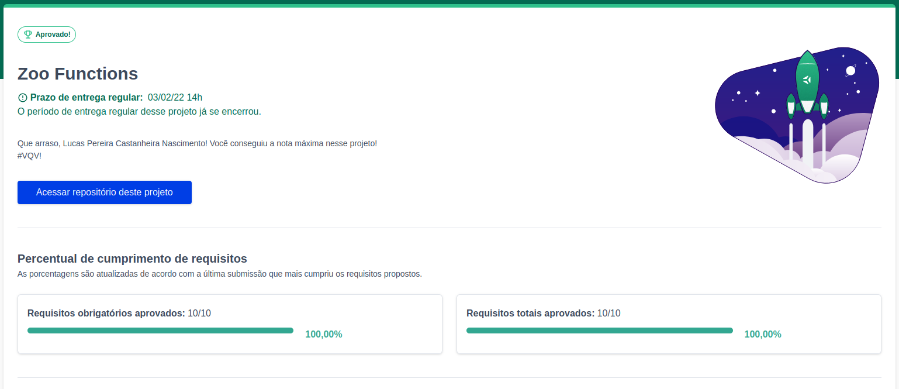

# zoo-functions

<h2>:brazil: Português :brazil:</h2>

Projeto entregue durante o curso de desenvolvimento Web ministrado pela <a href="https://www.betrybe.com" targe="_blank" rel="nofollow">Trybe</a>.

Obtive a aprovação no projeto, completando 100% dos requisitos obrigatórios e opcionais. Efetivando, assim, a conclusão do Bloco 8 (Higher Order Functions do JavaScript ES6) referente ao Módulo 1 (Fundamentos do Desenvolvimento Web).

Descrição:
 

O projeto tinha como objetivo implementar várias funções para atender aos requisitos propostos e garantir que todas as funções passem nos testes unitários.

Habilidades desenvolvidas

<ol>
<li>Produzir código legível, conciso e expressivo utilizando as novas funcionalidades do ES6;</li>
<li>Utilizar as Higher Order Functions para manipular e criar arrays;</li>
<li>Escolher a Higher Order Function mais adequada para a obtenção de um resultado esperado;</li>
<li>Aprender a usar de forma conjunta as Higher Order Functions;</li>
<li>Interpretar testes unitários e produzir soluções que atendam a eles.</li>
</ol>

<a href="https://www.linkedin.com/in/lucas-pereira-castanheira-nascimento-238355190/" targe="_blank" rel="nofollow">Meu Linkedin</a>.

 

<h2>:us: English :us:</h2>

Project delivered during the Web development course taught by <a href="https://www.betrybe.com" targe="_blank" rel="nofollow">Trybe</a>.

I passed the project, completing 100% of mandatory and optional requirements. Thus, completing Block 8 (Higher Order Functions of JavaScript ES6) referring to Module 1 (Fundamentals of Web Development).

Description:

The project aimed to implement several functions to meet the proposed requirements and ensure that all functions pass unit tests.

Developed skills

<ol>
<li>Produce readable, concise and expressive code using the new features of ES6;</li>
<li>Use Higher Order Functions to manipulate and create arrays;</li>
<li>Choose the Higher Order Function that is most suitable for obtaining an expected result;</li>
<li>Learn to use the Higher Order Functions together;</li>
<li>Interpret unit tests and produce solutions that meet them.</li>
</ol>

<a href="https://www.linkedin.com/in/lucas-pereira-castanheira-nascimento-238355190/" targe="_blank" rel="nofollow">My Linkedin</a>.

